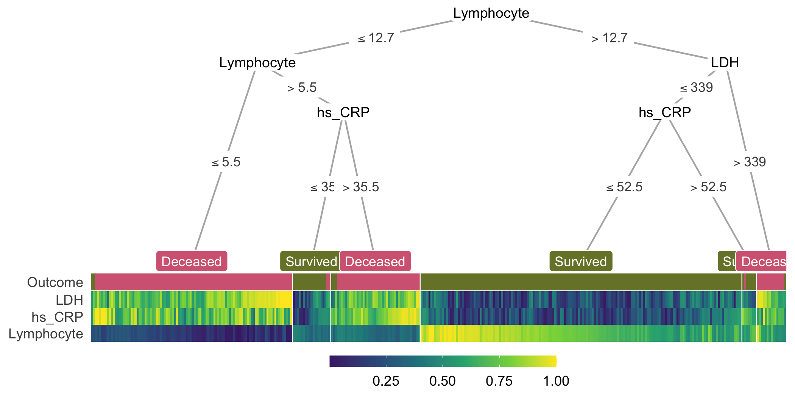

## A simple example

This example visualizes the conditional inference tree model built to predict whether or not a patient survived from COVID-19 in Wuhan, China [@doi:10.1038/s42256-020-0180-7].
The dataset contains blood samples of 351 patients admitted to Tongji hospital between January 10 and February 18, 2020.
Three features were selected based on their importance score from a multi-tree XGBoost model, including lactic dehydrogenase (LDH), lymphocyte levels and high-sensitivity C-reactive protein (hs_CRP).
Detailed characteristics of the samples can be found in the original publication [@doi:10.1038/s42256-020-0180-7].

The following lines of code compute and visualize the conditional decision tree along with the heatmap containing features that are important for constructing this model (Fig. @fig:example):

```r
heat_tree(
  data = covid,
  target_lab = 'Outcome',
  label_map = c(`0` = 'Survived', `1` = 'Deceased')
)
```

The `heat_tree()` function takes a data frame, a character string specifying the column name associated with the phenotype/outcome and other optional arguments such as the mapping of the outcome label. 

{#fig:example}

In the decision tree, the leaf nodes are labeled based on their majority votes and colored to correlate with the true outcome.
On the right split of hs_CRP (hs_CRP ≤ 52.5 and hs_CRP > 52.5), although individuals of both branches are all predicted to survive by majority voting, the leaf nodes have different purity, indicating different confidence levels the model has in classifying samples in the two nodes.
These seemingly non-beneficial splits present an opportunity to teach machine learning novices the different measures of node impurity such as the Gini index or cross-entropy [@isbn:978-0387848570].

In the heatmap, each (very thin) column is a sample, and each row represents a feature or the outcome.
For a specific feature, the color shows the relative value of a sample compared to the rest of the group on that feature; higher values are associated with lighter colors.
Within the heatmap, similar color patterns between LDH and hs_CRP suggest a positive correlation between these two features, which is expected because they are both systemic inflammation markers.

Together, the tree and heatmap give us an approximation of the proportion of samples per leaf and the model's confidence in its classification of samples in each leaf.
Three main blocks of different Lymphocyte levels in the heatmap illustrate its importance as a determining factor in predicting patient outcome.
When this value is below 12.7 but larger than 5.5 (observations with dark green Lymphocyte value), hs_CRP helps further distinguish the group that survived from the other.
Here, if we focus on the hs_CRP > 35.5 branch, we notice that the corresponding hs_CRP colors range from light green to yellow (> 0.5), illustrating that the individuals in this branch have higher hs_CRP than the median of the group.
This connection is immediate with the two components visualized together but would not have been possible with the tree model alone.
In summary, the tree and heatmap integration provides a comprehensive view of the data along with key characteristics of the decision tree.