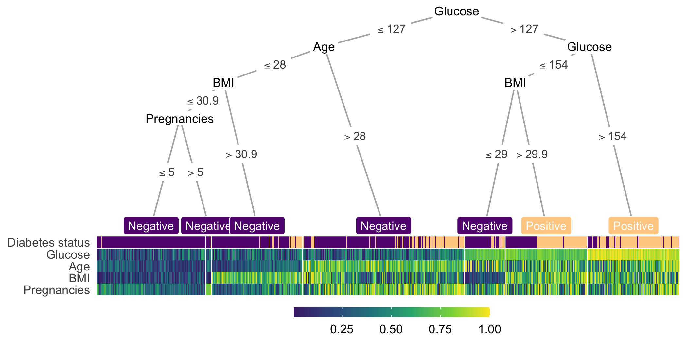

## A simple example

This example visualizes the conditional inference tree model built to predict whether or not a patient has diabetes from a dataset provided by the National Institute of Diabetes and Digestive and Kidney Diseases [@pmcid:PMC2245318].
This dataset of female patients at least 21 years old of Pima Indian heritage near Phoenix, Arizona was downloaded from [Kaggle](https://www.kaggle.com/uciml/pima-indians-diabetes-database) and has eight features: age, number of pregnancies, plasma glucose concentration, diastolic blood pressure, skin fold thickness, 2-hour serum insulin, body mass index and diabetes pedigree function.
Detailed descriptions of these variables and data source can be found on the Kaggle page.

The following lines of code computes and visualizes the conditional decision tree along with the heatmap containing features that are important for building this model (Fig. @fig:example):

```
heat_tree(
  data = diabetes,
  target_lab = 'Diabetes status',
  label_map = c(`0` = 'Negative', `1` = 'Positive')
)
```

The `heat_tree()` function takes a data frame, a character string indicating the column name associated with the outcome/phenotype (e.g., Diabetes status) and other optional arguments such as the mapping of the outcome label. 

{#fig:example}