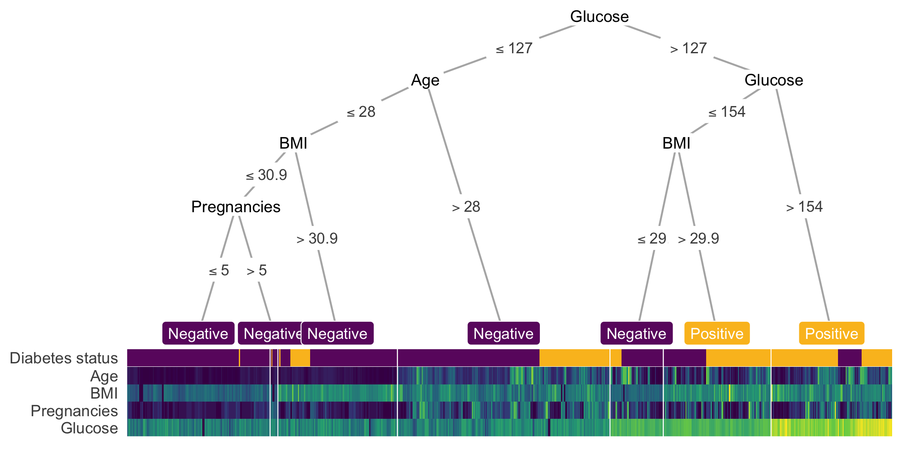

---
author-meta:
- Trang T. Le
- Jason H. Moore
bibliography:
- content/manual-references.json
date-meta: '2020-05-01'
header-includes: '<!--

  Manubot generated metadata rendered from header-includes-template.html.

  Suggest improvements at https://github.com/manubot/manubot/blob/master/manubot/process/header-includes-template.html

  -->

  <meta name="dc.format" content="text/html" />

  <meta name="dc.title" content="treeheatr: an R package for interpretable decision tree visualizations" />

  <meta name="citation_title" content="treeheatr: an R package for interpretable decision tree visualizations" />

  <meta property="og:title" content="treeheatr: an R package for interpretable decision tree visualizations" />

  <meta property="twitter:title" content="treeheatr: an R package for interpretable decision tree visualizations" />

  <meta name="dc.date" content="2020-05-01" />

  <meta name="citation_publication_date" content="2020-05-01" />

  <meta name="dc.language" content="en-US" />

  <meta name="citation_language" content="en-US" />

  <meta name="dc.relation.ispartof" content="Manubot" />

  <meta name="dc.publisher" content="Manubot" />

  <meta name="citation_journal_title" content="Manubot" />

  <meta name="citation_technical_report_institution" content="Manubot" />

  <meta name="citation_author" content="Trang T. Le" />

  <meta name="citation_author_institution" content="Department of Biostatistics, Epidemiology and Informatics, Institute for Biomedical Informatics, University of Pennsylvania, Philadelphia, PA 19104" />

  <meta name="citation_author_orcid" content="0000-0003-3737-6565" />

  <meta name="twitter:creator" content="@trang1618" />

  <meta name="citation_author" content="Jason H. Moore" />

  <meta name="citation_author_institution" content="Department of Biostatistics, Epidemiology and Informatics, Institute for Biomedical Informatics, University of Pennsylvania, Philadelphia, PA 19104" />

  <meta name="citation_author_orcid" content="0000-0002-5015-1099" />

  <meta name="twitter:creator" content="@moorejh" />

  <link rel="canonical" href="https://trang1618.github.io/treeheatr-manuscript/" />

  <meta property="og:url" content="https://trang1618.github.io/treeheatr-manuscript/" />

  <meta property="twitter:url" content="https://trang1618.github.io/treeheatr-manuscript/" />

  <meta name="citation_fulltext_html_url" content="https://trang1618.github.io/treeheatr-manuscript/" />

  <meta name="citation_pdf_url" content="https://trang1618.github.io/treeheatr-manuscript/manuscript.pdf" />

  <link rel="alternate" type="application/pdf" href="https://trang1618.github.io/treeheatr-manuscript/manuscript.pdf" />

  <link rel="alternate" type="text/html" href="https://trang1618.github.io/treeheatr-manuscript/v/bcf31690299783319364838f7b190914965876fd/" />

  <meta name="manubot_html_url_versioned" content="https://trang1618.github.io/treeheatr-manuscript/v/bcf31690299783319364838f7b190914965876fd/" />

  <meta name="manubot_pdf_url_versioned" content="https://trang1618.github.io/treeheatr-manuscript/v/bcf31690299783319364838f7b190914965876fd/manuscript.pdf" />

  <meta property="og:type" content="article" />

  <meta property="twitter:card" content="summary_large_image" />

  <link rel="icon" type="image/png" sizes="192x192" href="https://manubot.org/favicon-192x192.png" />

  <link rel="mask-icon" href="https://manubot.org/safari-pinned-tab.svg" color="#ad1457" />

  <meta name="theme-color" content="#ad1457" />

  <!-- end Manubot generated metadata -->'
keywords:
- machine learning
- decision trees
- heatmap
- visualization
- interpretability
lang: en-US
manubot-clear-requests-cache: false
manubot-output-bibliography: output/references.json
manubot-output-citekeys: output/citations.tsv
manubot-requests-cache-path: ci/cache/requests-cache
title: 'treeheatr: an R package for interpretable decision tree visualizations'
...


<small><em>
This manuscript
([permalink](https://trang1618.github.io/treeheatr-manuscript/v/bcf31690299783319364838f7b190914965876fd/))
was automatically generated
from [trang1618/treeheatr-manuscript@bcf3169](https://github.com/trang1618/treeheatr-manuscript/tree/bcf31690299783319364838f7b190914965876fd)
on May 1, 2020.
</em></small>

## Authors


+ **Trang T. Le**<br>
    {.inline_icon}
    [0000-0003-3737-6565](https://orcid.org/0000-0003-3737-6565)
    · {.inline_icon}
    [trang1618](https://github.com/trang1618)
    · {.inline_icon}
    [trang1618](https://twitter.com/trang1618)<br>
  <small>
     Department of Biostatistics, Epidemiology and Informatics, Institute for Biomedical Informatics, University of Pennsylvania, Philadelphia, PA 19104
  </small>

+ **Jason H. Moore**<br>
    {.inline_icon}
    [0000-0002-5015-1099](https://orcid.org/0000-0002-5015-1099)
    · {.inline_icon}
    [EpistasisLab](https://github.com/EpistasisLab)
    · {.inline_icon}
    [moorejh](https://twitter.com/moorejh)<br>
  <small>
     Department of Biostatistics, Epidemiology and Informatics, Institute for Biomedical Informatics, University of Pennsylvania, Philadelphia, PA 19104
     · Funded by National Institutes of Health Grant Nos. [LM010098, LM012601, AI116794]
  </small>


## Abstract {.page_break_before}

### Summary
*treeheatr* is an R package for creating interpretable decision tree visualizations with the data represented as heatmaps at the tree's terminal nodes.
Going beyond the if-then step-by-step logic of a decision tree, the inclusion of a heatmap offers a broader view of the classification or regression problem and provides meaningful clarification of different node splits in the tree.
Working harmoniously with other packages, *treeheatr* empowers the user with refined controls over the statistical threshold and presentation of the tree and heatmap.

### Availability and implementation
The *treeheatr* package is freely available under the permissive [MIT license](https://opensource.org/licenses/MIT) at <https://trang1618.github.io/treeheatr>.
It comes with a detailed vignette that is automatically built with [GitHub Actions](https://github.com/features/actions) continuous integration.

### Contact
<ttle@pennmedicine.upenn.edu>

### Supplementary information
[Supplementary data](https://trang1618.github.io/treeheatr) are available at Bioinformatics online.

## Introduction

Tree-based algorithms such as random forests and gradient boosted trees are widely used techniques that comprise an important section of supervised machine learning.
Visualizing and intepreting their building blocks, the single decision trees, are the first steps toward understanding these complex tree-based structures.
However, it is difficult to incorporate the tree's predictive performance and the feature space in a single visualization.
Existing softwares frequently treat all nodes in a decision tree similarly, leaving limited options for improving information presentation at the leaf nodes.
Specifically, state-of-the-art libraries such as Python's [dtreeviz](https://github.com/parrt/dtreeviz), while producing aesthetic trees with detailed histograms at inner nodes, draw pie chart at leaf nodes.
The *ggparty* R package allows the user to have full control of the representation of each node but fixes the terminal node widths, which can limit the ability to show more collective visualizations.

We have developed the *treeheatr* package to utilize the leaf node space to show the data as a heatmap where the samples and features are optionally clustered to improve interpretation.
After simple installation, the user can apply *treeheatr* on their classification or regression problem with a single function:
```
heat_tree(data, task = 'classification', target_lab = 'Outcome')
```
This one line of code above will generate the conditional inference tree, perform clustering, and produce a decision tree-heatmap as a *ggplot* object that can be viewed in RStudio's viewer pane, saved to a graphic file, or embedded in an RMarkdown document.
This example assumes a classification problem, but one can also apply *treeheatr* on a regression problem by changing the `task` argument.

This article is organized as follows.
In Section 2, we show an example *treeheatr* application by employing its functions on a real-world clinical dataset from a study of diabetes mellitus in a high risk population of Pima Indians [@pmcid:PMC2245318].
In Section 3, we describe in details the important functions and corresponding arguments in *treeheatr*.
We demonstrate the flexibility the user has in tweaking these arguments to enhance understanding of the tree-based models applied on their dataset.
Finally, we discuss general guidelines for creating effective decision tree-heatmap visualization.


## A simple example

This example visualizes the conditional inference tree model built to predict whether or not a patient has diabetes from a dataset provided by the National Institute of Diabetes and Digestive and Kidney Diseases [@pmcid:PMC2245318].
This dataset of 768 female patients at least 21 years old of Pima Indian heritage near Phoenix, Arizona was downloaded from [Kaggle](https://www.kaggle.com/uciml/pima-indians-diabetes-database) and has eight features: age, number of pregnancies, plasma glucose concentration, diastolic blood pressure, skin fold thickness, 2-hour serum insulin, body mass index (BMI) and diabetes pedigree function.
Detailed descriptions of these variables and data source can be found on the Kaggle page.

The following lines of code computes and visualizes the conditional decision tree along with the heatmap containing features that are important for building this model (Fig. @fig:example):

```
heat_tree(
  data = diabetes,
  target_lab = 'Diabetes status',
  label_map = c(`0` = 'Negative', `1` = 'Positive')
)
```

The `heat_tree()` function takes a data frame, a character string indicating the column name associated with the outcome/phenotype (e.g., Diabetes status) and other optional arguments such as the mapping of the outcome label. 

{#fig:example}

In this example, we observe that glucose level is the first determining factors in predicting diabetes status.
When this value is above 127 but not larger than 154 (observations with light green glucose value), BMI helps further distinguish the group with diabetes from the other.
On the left branches, while these samples are predicted to not have diabetes by majority voting, the leaf nodes have different purity.
These seemingly non-beneficial splits present an opportunity to teach machine learning novices the different measures of node impurity such as the Gini index or cross-entropy [@isbn:978-0387848570].
General patterns in the heatmap for this example can be difficult to parse because of the large number of observations, but we can still observe similar color patterns between age and the number of pregnancies indicating a correlation between these two features, which is expected.

## Methods

Conditional decision trees [@doi:10.1198/106186006X133933] are nonparametric models performing recursive binary partitioning with well-defined theoretical background.
Conditional trees support unbiased selection among covariates and avoid overfitting problems, producing competitive prediction accuracy [@doi:10.1198/106186006X133933].
*treeheatr* utilizes the *ggparty* R package to compute the conditional tree for a classification or regression problem (indirectly via the *partykit* R package) along with its edge and node information.

While *ggparty* assumes fixed terminal widths, *treeheatr* employs a flexible node layout to accommodate the different number of samples shown in the heatmap at each terminal node.
This new node layout structure supports various terminal node widths, prevents crossings of different tree branches, and generalizes as the trees grow in size.
This new layout weighs the *x*-coordinate of the parent node according to the level of the child nodes in order to avoid crossing of tree branches.
This relative weight can be adjusted with the `lev_fac` parameter in `heat_tree()`.
`lev_fac = 1` sets the parent node's *x*-coordinate perfectly in the middle of those of its child nodes.
The default `lev_fac = 1.3` seems to provide aesthetically pleasing trees independent of the tree size (see [vignette](https://trang1618.github.io/treeheatr/articles/explore.html)).
The user can define a customized layout for a specific set of nodes and combine that layout with the automatic layout for the other nodes.

As default, *treeheatr* automatically performs clustering when organizing the heatmap.
To order the features, clustering is run on the two groups of features, continuous and categorical, across all samples (including the outcome label, unless `clust_target = FALSE`).
To order the samples, clustering is run on samples within each terminal node of all features. 
*treeheatr* uses the `daisy()` function in the [*cluster*](https://cran.r-project.org/web/packages/cluster/) R package with the Gower metric [@doi:10.2307/2528823] to compute dissimilarity in both continuous and nominal categorical feature types. 
We note that, while there is no definitive guideline for proper weighting of features of different types, the goal of the clustering step is to improve our interpretability of the tree-based model and not to make precise inference about each cluster.
Therefore, *treeheatr* does not draw dendrograms and allows for the inclusion of outcome labels in clustering the samples.

In a visualization, it is difficult to strike the balance between enhancing understanding and overloading information.
We believe showing a heatmap at the terminal node space provides additional information of the data in an elegant way that is not overwhelming and may even simplify the model's interpretation. 
We left it for the user to decide what type of information to be displayed at the inner nodes via different *geom* objects (e.g., `geom_node_plot`, `geom_edge_label`, etc.) in the *ggparty* package.
For example, one may choose to show the [distribution](https://github.com/martin-borkovec/ggparty/wiki/1-Motivating-Example) of the features and how they split the samples at these decision nodes, or each feature's corresponding Bonferroni-adjusted *P*
values computed in the conditional tree algorithm [@doi:10.1198/106186006X133933].

Striving for simplicity, *treeheatr* utilizes direct labeling to avoid unnecessary legends.
For example, in classification, the leaf node labels have colors corresponding with different classes, e.g., purple for Negative and yellow for Positive diabetes status (Fig. @fig:example).
As for feature values, the color scale legends may be misleading because these features may have been rescaled or normalized.
As defaults, lighter colors are associated with higher values.
This information can also be acquired from examining the edge labels.
Specifically, in Fig. @fig:example, high glucose values (larger than 154 on the rightmost branch) can be easily mapped to samples with light yellow color in the last row.

The integration of heatmap nicely complements the current techniques of visualizing decision trees.
Node purity, a metric measuring the tree's performance, can be visualized from the distribution of true outcome label at each terminal node in the first row.
Comparing these values with the terminal node label gives a visual estimate of how accurate the tree predictions are.
Further, without specifically choose two features to show in a 2-D scatter plot, we can infer correlation structures among features in the heatmap.
The additional clustering may also reveal sub-structures within a leaf node.


## Conclusion

In this paper, we presented the new type of integrated visualization of decision trees and heatmaps, which provides a comprehensive data overview as well as model interpretation.
We demonstrated that [...]
The visualization is implemented in an easily installed package with a detailed vignette.
Released as open source software, {treeheatr} hopes to receive contribution from other developers.

Future works on *treeheatr* include enhancements such as supporting heatmap visualization of a holdout set and highlighting the tree branches that point to a specific holdout sample.

## Acknowledgements

The *treeheatr* package was made possible by leveraging integral R packages including *ggplot2* [@isbn:978-0387981406], *partykit* [@url:http://jmlr.org/papers/v16/hothorn15a.html], [*ggparty*](https://github.com/martin-borkovec/ggparty) and many others.
We would also like to thank Daniel Himmelstein for his helpful comments on the package's continuous integration configuration.

## References {.page_break_before}

<!-- Explicitly insert bibliography here -->
<div id="refs"></div>
